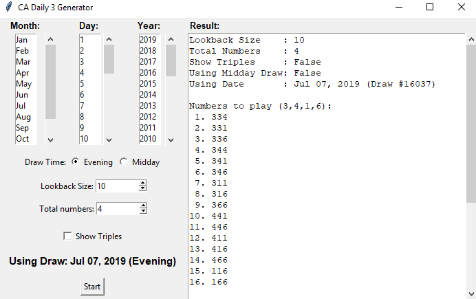

# calottery Daily 3 Number Generator

NOTE: calottery.com no longer provides the .txt file containing historical data that this program uses. If you have an old copy of one, you may use ```--use-local [file]```.

TODO: rewrite program to use JSON from REST API (explained below)

Poking around the site, I found that historical data can be fetched with a REST API that returns a JSON:

```
GET /api/DrawGameApi/DrawGamePastDrawResults/9/1/20 HTTP/1.1
Host: www.calottery.com
```

where the parameters are ```/Game ID#/Page#/Total```

Explanation:

```Game ID#``` to Game -
* 9: Daily3
* 10: Fantasy 5
* 11: Daily Derby
* 12: Powerball

```Page#/Total``` -

```Total``` indicates how many draws to return. It can range from 1 to 50.

```Page#``` indicates which index of ```Total``` to return.

For example,

```1/20``` returns the 20 most recent draws, i.e. draws 1-20

```2/20``` returns draws 21-40

```3/20``` returns draws 41-60

and so on

So, it is possible with a multiple API calls and combination of returned JSONs to get all historical data as this program requires.

----

Parses calottery's .txt of Daily 3 results to generate playable Daily 3 numbers using the "hot number" strategy, wherein the least played numbers over a certain amount of draws are considered playable.

## Dependencies

Python3, tkinter, requests

## Options

```
> python3 daily3generator.py --help

usage: daily3generator.py [-h] [--uselocal USELOCAL]

optional arguments:
  -h, --help           show this help message and exit
  --uselocal USELOCAL  Local file to read instead of fetching from
                       calottery.com

```

## Example output

